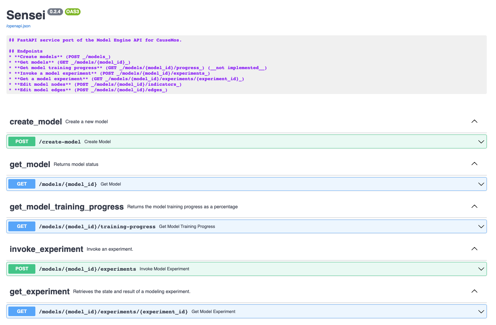

# Sensei
[](https://github.com/dojo-modeling/sensei/actions/workflows/docker.yaml)

v0.2.4

## Modeling Engine

Sensei is a data-driven top-down modeling engine that provides projections, as well as parameter and uncertainty estimates for time series where variable relationships are defined by a CAG structure. Sensei models the multivariate time series as a set of univariate time series models with "regressors" defined by the CAG structure. That is to say, each node in the CAG gets its own model, which consists of a univariate time series model which parameterizes the trend and seasonality of the time series, as well as coefficients on the incoming edges from one-step-behind values. We compute parameters and projections step-wise, i.e. every model estimates one-time-step-ahead projections iteratively. 

The model we use for univariate time series is the [Damped Local Trend (DLT)](https://uber.github.io/orbit/tutorials/dlt.html) model , variants of which are generally top performers on the [M3 competition](https://www.google.com/search?q=m3+competition+forecasting&ei=a4BEYozsD5GUkwWcka6oBQ&ved=0ahUKEwjMzZKEnO72AhURyqQKHZyIC1UQ4dUDCA4&uact=5&oq=m3+competition+forecasting&gs_lcp=Cgdnd3Mtd2l6EAMyBQgAEIAEMgYIABAWEB46BwgAEEcQsAM6BwgAELADEEM6CggAEOQCELADGAE6FQguEMcBEKMCENQCEMgDELADEEMYAjoPCC4Q1AIQyAMQsAMQQxgCOgQIABBDOggIABCABBDJA0oECEEYAEoECEYYAVD6A1jYEGCaEWgBcAF4AIABT4gBuwaSAQIxMpgBAKABAcgBEsABAdoBBggBEAEYCdoBBggCEAEYCA&sclient=gws-wiz). The parameters and uncertainty are estimated using Maximim A Posteriori (MAP) which offers good accuracy at interactive speed. 

## Installation and Setup

Sensei is run as a a standalone system, or integrated with Causemos, in the same manner. As a Dockerized application, it is easily run with:

```
docker-compose up -d
```

This will build the Docker image, and run the Sensei API. The API is available on the localhost at port 8088 so you can navigate to [`localhost:8088`](localhost:8088) to interact with it's FastAPI user interface and API documentation:

<p align="center">
    
    <br/>
    <i>Sensei's API documentation and interface available at <code>localhost:8088</code></i>
<p>

A pre-built version of the Sensei container is available on Dockerhub and can be fetched with:

```
docker pull jataware/sensei
```

However, due to important volume mounts, it is recommended to use the `docker-compose` indicated above.

### Developing Sensei

To develop Sensei, you should run the project locally by installing the project's development dependencies. This can be accomplished with:

```
python -m pip install -r requirements-dev.txt
```

### Version Bumping

The project is configured to use [bump2version](https://github.com/c4urself/bump2version)

An example usage to change the version

```
bump2version --current-version 0.2.4 --new-version 0.1.7 minor --allow-dirty
```

using `--allow-dirty` allows you to verify the changes before committing them but requires you to commit manually.
See [https://pypi.org/project/bump2version/](https://pypi.org/project/bump2version/) for more advanced usage.
